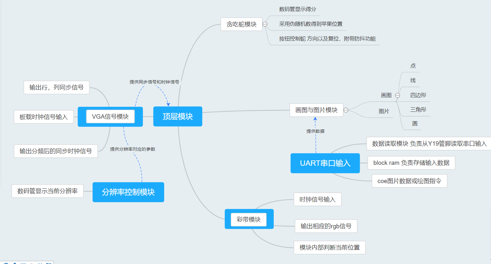
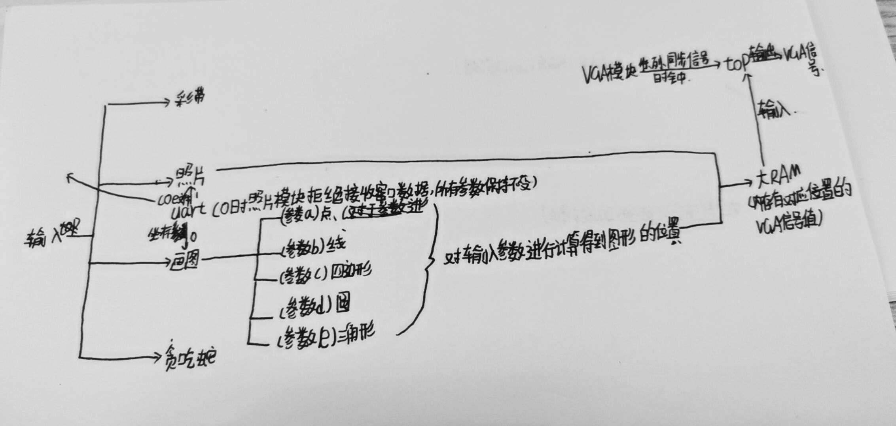
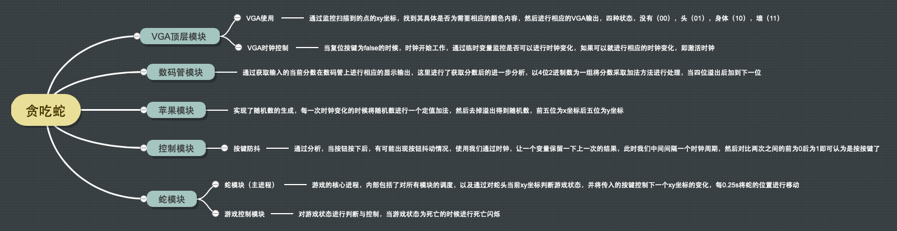
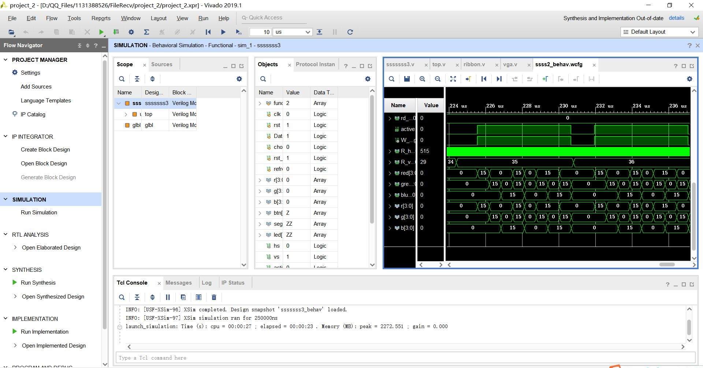
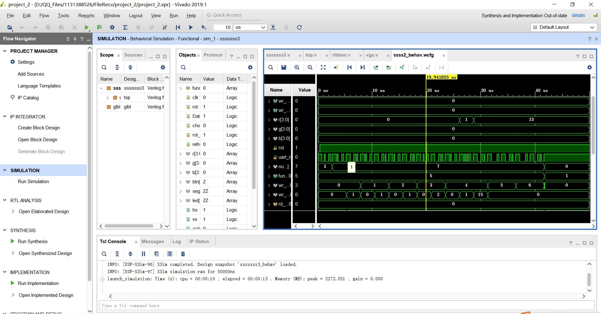
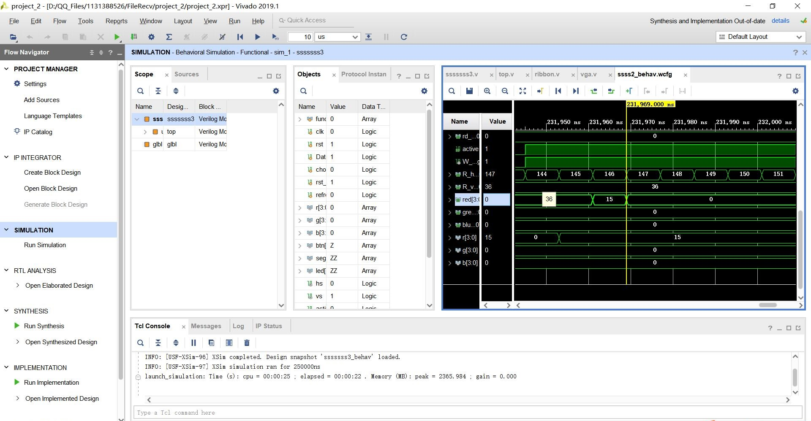
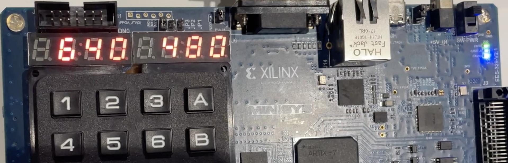
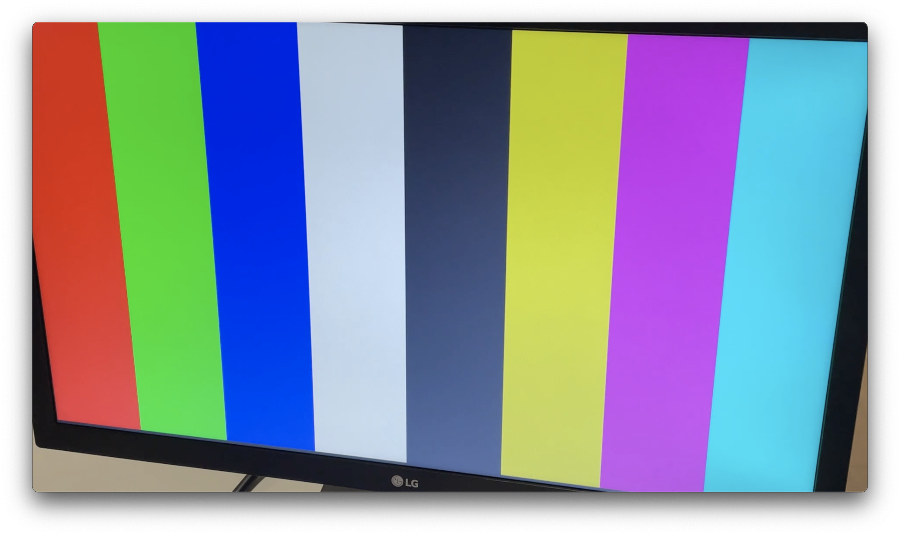
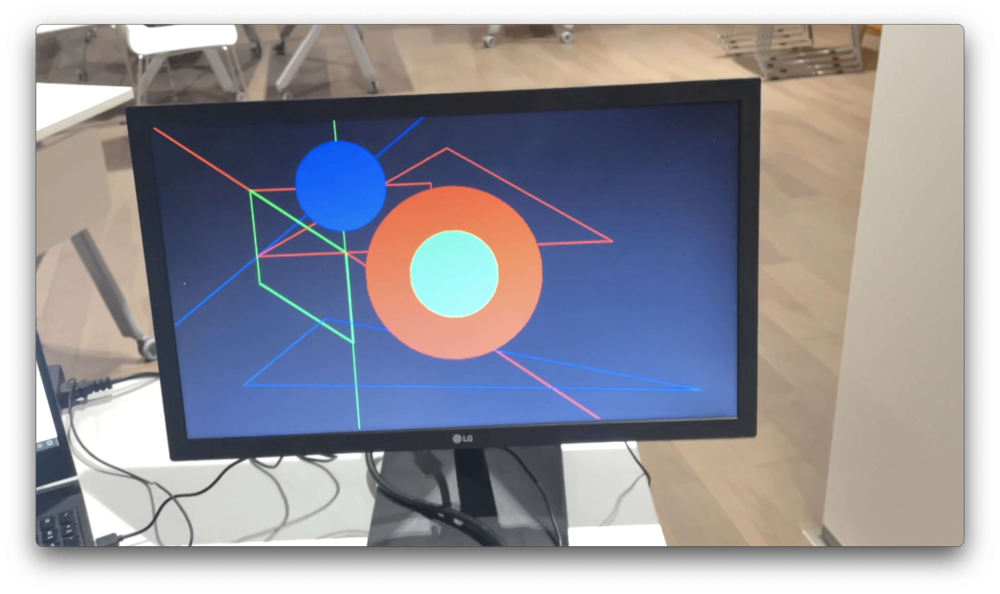
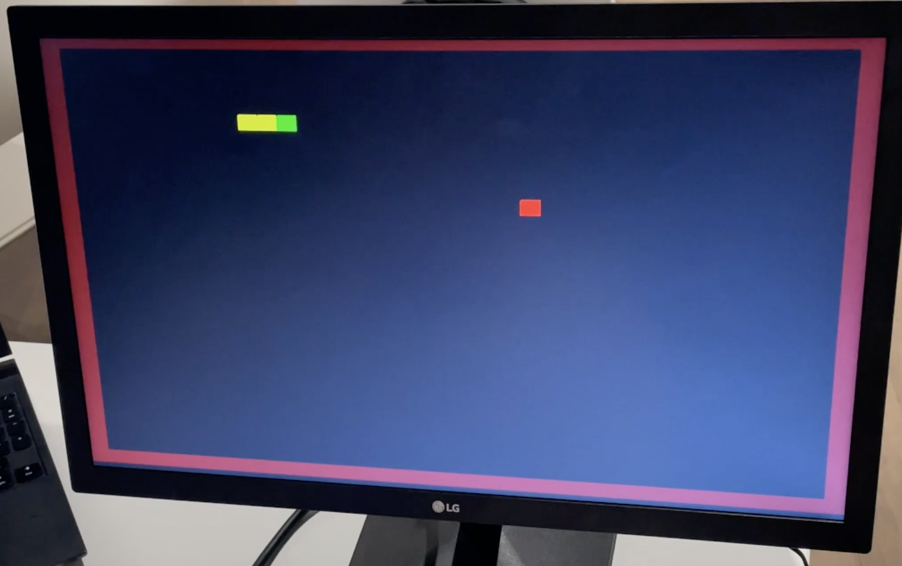

# VGA Verilog实现
### 南方科技大学 数字逻辑project-VGA实现


# 目录
- [需求分析](#需求分析)
- [工程日志](#工程日志)
- [功能与原理](#功能与原理)
- [项目优化](#优化)
- [端口情况](#端口情况)
- [实现效果](#实现效果)
- [模拟过程](#模拟过程)
- [分工](#分工)
# 需求分析
- 系统功能：显示彩带，通过串口发送图片并显示，通过串口指令绘图，画面平铺，贪吃蛇游戏，切换分辨率并在七段数码管上显示
- 输入输出设备：拨码开关，按钮，板载时钟，七段数码管，UART端口
# 工程日志
2020-12日志         
-08:项目分工，初期讨论，以及内容的选择           
-12:我们将彩带功能的实现进行调试，通过进行模拟的方法成功de掉了一部分漏洞      
-13:彩带功能完善实现        
-14:VGA模块串口相关的内容基本实现
-16:VGA画图功能开始攻关
-18:VGA画图调试
-20:画图功能实现
-21:VGA分辨率功能实现
-22:贪吃蛇模块实现，所有模块组装完成
# 功能与原理
##### 目前实现的功能如下：
- <h5>VGA模块</h5>        
- <h5>彩带</h5>       
- <h5>串口输入</h5>         
- <h5>图片显示</h5>     
- <h5>画图</h5>           
- <h5>贪吃蛇</h5>  

下面对实现的原理依次进行说明:             
### VGA模块
  VGA模块接收100MHz的板载时钟信号，通过分频得到特定频率的时钟信号。分别保存行，列位置的计数器，与所需分辨率对应的参数对比，并以此输出行，列同步信号。
### 彩带
  彩带模块中将VGA显示时间均分为8个时间段，在特定时间段中对输出的r,g,b各个分量进行赋值，实现显示彩带的功能。
### 串口数据接收
  接收模块根据输入时钟频率和波特率计算出每一位数据的传输时间，在每一位数据传输的中间时刻进行采样，每8位数据作为一个8位ascii码进行解码后存储。
### 显示图片
  先用学助提供的脚本将待显示图片转换成二进制文件，我们自行编写了脚本将二进制文件中但每8byte转换成3位16进制数，分别表示一个像素点的r,g,b值，并存入block ram中。需要显示时，顶层模块每个时刻从block ram中读出当前位置的r,g,b值并输出到显示器上。
## 这部分结构图如下：

### 画图
##### 输入
行信号与列信号，当前分辨率的时钟信号，以及功能模块控制信号。
##### 输出
block ram中的写状态地址，写状态地址对应的12位r,g,b数据。
##### 原理
基于我们已经使用block ram来存储屏幕上对应的VGA信号信息，我们在此基础上，又开出了一个 12 * 20 的ram，用来存储当调用画图模块时所需的各个参数。我们规定a代表画点，b代表画直线，c代表画四边形形，d代表画园，e代表画三角形。我们实现了一个4位的选择器，该选择器会随着a,b,c,d,e的串口输入而发生值的变化，通过判断选择器的值，我们调用不同的作图模块，返回block ram中对应地址的12位r,g,b数据。
## 这部分结构图如下：

### 贪吃蛇
  贪吃蛇模块通过一个顶级模块进行各个子模块的协调运行，其中顶级模块play_snake_game采用了三个输入端，分别是时钟信号，复位信号，四个方向按钮。输出则为数码管和VGA同时输出的。                
  通过数码管输出当前用户得分，然后通过VGA显示游戏界面，在主模块中通过wire中间变量传递不同的数据。
通过这个模块，依次控制了如下的几个模块：
- Game_Control 游戏主进程控制      
通过主进程，对整个程序中多个变量进行调配，利用几个临时变量存储的方法，从而保证不会存在端口竞争问题，例如：
```Verilog
    wire left_key;
	wire right_key;
	wire up_key;
	wire down_key;//按键
	wire [1:0]snake;//蛇及其位置
	wire [9:0]x;
	wire [9:0]y;
	wire [5:0]apple_x;//苹果位置
	wire [4:0]apple_y;
	wire [5:0]head_x;//蛇头位置
	wire [5:0]head_y;
	wire add;
	wire[1:0]win;//输赢
	wire hit_wall;//判断是否输了
	wire hit_body;
	wire die_flash;//死亡频闪
	wire restart;//重启游戏
	wire [6:0]snake_length;//蛇长度
	wire rst_n;
```
然后利用不同的变量传递值在所有程序模块中，实现游戏的运行。
- apple 贪吃蛇中苹果的位置，主要是随机数            
通过利用时钟特点，每一次对随机数加一个值（999），当蛇吃到苹果后，获取这个值，前五位作为x后五位是y。
- snake 游戏主角蛇的定位            
本模块实现了对整个游戏的全部调配，包括游戏状态判断，蛇的位置，苹果的位置，以及是否已经触发死亡，按钮的控制转化。
- VGA_top VGA输出模块           
VGA实现的是一个640x480的60Hz的VGA输出，VGA模块接收100MHz的板载时钟信号，通过分频得到特定频率的时钟信号。分别保存行，列位置的计数器，与所需分辨率对应的参数对比，并以此输出行，列同步信号。这里为了防止在复位时的情况，将时钟采取了处理（当察觉到复位结束后才会激活一个临时变量时钟，而这个时钟可以控制标准时钟的运行），当复位结束后才会开始工作。
- Keyboard 小键盘获取分析模块            
本模块对按键防抖进行了处理，当按钮按下后，我们通过时钟比较上一个周期的值与当前周期中的值，我们只检测按下的控制，达到防抖目的。
- seg_play 数码管模块            
通过主模块获取当前得分情况，然后将得分传入后进行处理，通过时钟将每一个数字依次打到数码管上，利用人眼暂留实现分数计数。                
## 这部分结构图如下：

# 优化
- 显示图片    
开始时，我们直接发送了二进制格式的图片，但每个像素点都有12位，发送速度很慢。于是我们编写脚本，将4位二进制转为1位16进制数，发送速度提高了4倍。我们又删去了像素点信息之间的逗号，并改写串口程序，又将发送速度提高了25%。在显示图片时，我们选择边读入边刷新屏幕，而不是全部读入后再显示，这样图片会逐渐显示在屏幕上，显示过程更加流畅。
- 画图
画直线时我们将k和b放大了1000倍后进行判断，减少了因为小数部分带来的误差。画圆等图形时，由于分辨率并非1:1，导致画出的图形会被压缩，我们引入了一些常量使得它们能够被正确地显示
- 按钮消抖
在按钮按下的时候对上一个时钟周期里面的存下的值进行判断，如果两个值正好相反，则认为进行了一次按压，我们只关注按下，这样可以避免抖动问题
- 伪随机算法
利用时钟进行伪随机算法。保存一个10位的reg,每个时钟跳变沿对它的值增加999，可以得到伪随机数，作为贪吃蛇中下一个苹果的坐标，是比较优化的算法。
# 端口情况
最左侧两个拨码开关负责系统复位和block ram数据复位。最右侧4个拨码开关代表功能选择，全部关闭时为画图，从右侧数第一个打开时为显示图片，第二个打开时为显示彩带，第三个打开时为贪吃蛇游戏，第四个打开时为画面平铺效果。第五个拨码开关负责分辨率切换，关闭时为640\*480，打开时为640\*400。四个按钮控制贪吃蛇的移动，中间的按钮为贪吃蛇游戏复位键。七段数码管在贪吃蛇游戏中显示当前得分，其他情况显示当前分辨率。我们也使用了板载时钟（Y18端口）和UART串口（Y19）作为输入。
# 模拟过程
我们在本次实验中进行测试模拟的一共有三次，分别是        
1.彩带显示过程中显示异常处理
   
2，3.图片显示的异常，没有输出



# 实现效果
分辨率于数码管显示           
          
彩色条带

图片显示


画图模块


贪吃蛇


# 分工
贡献度三人均分             
韩梓辰：贪吃蛇模块，写作与整合\
鲁明海：串口读取，条带显示，图片显示\
张博文：画图，顶层设计整合
